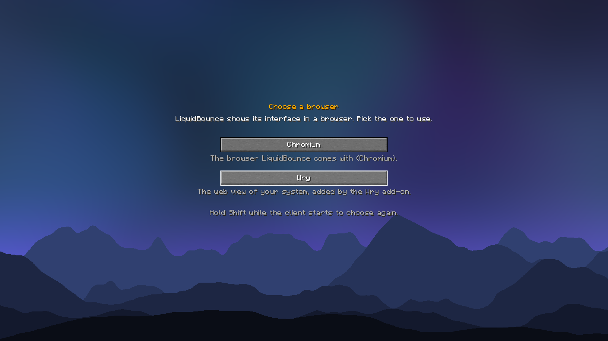
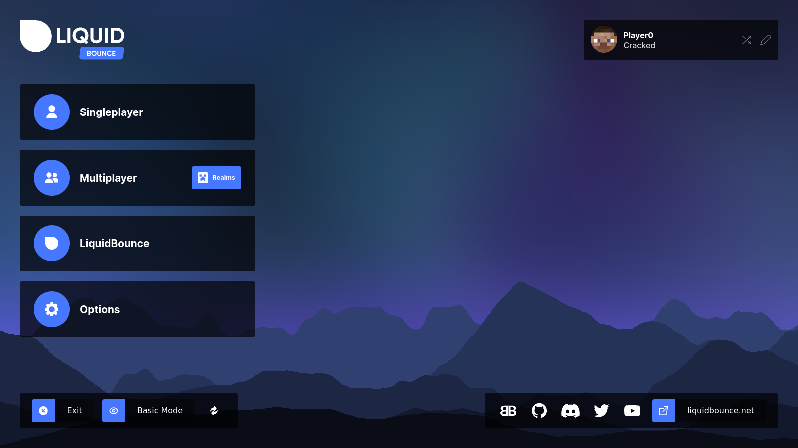

# LiquidBounce Wry

A [LiquidBounce](https://github.com/CCBlueX/LiquidBounce) add-on that lets the client show its menus with the web view
that comes with your system, through [Wry](https://github.com/tauri-apps/wry), instead of the built-in Chromium. It is
only an alternative: LiquidBounce does not run better or faster with it.

With the add-on installed, LiquidBounce asks which browser to use the next time it starts. The choice is remembered;
hold Shift while the client starts to choose again. `LB_BROWSER_BACKEND=wry` picks it without asking.

| Choosing | Wry |
|---|---|
|  |  |

| System | Web view | Needs |
|---|---|---|
| Windows 10 and 11 | WebView2 | the WebView2 runtime, which comes with Windows 11 and updated Windows 10 |
| macOS | WKWebView | nothing |
| Linux | WebKitGTK | `webkit2gtk-4.1` from your distribution, e.g. `sudo pacman -S webkit2gtk-4.1` or `sudo apt install libwebkit2gtk-4.1-0` |

The web view draws off-screen and its frames go into a texture of the game. When the game renders with OpenGL they
stay on the GPU (shared textures on Windows, IOSurfaces on macOS, dmabufs on Linux when the game renders through EGL),
otherwise they are copied through memory. `LB_BROWSER_DISABLE_ACCELERATION=true` always copies them.

## Building

Besides JDK 25 this needs [Rust](https://rustup.rs), and on Linux the WebKitGTK development files
(`libwebkit2gtk-4.1-dev` on Debian and Ubuntu).

```
./gradlew build
```

builds the native library in [`native/`](native) for your system and puts it into the jar. CI builds it for every
platform and passes the libraries with `-Pnatives=<dir>`.

`./gradlew runClientGameTest` starts the client with the add-on, picks Wry on the selection screen and takes the
screenshots above. `cargo run --release --bin selftest` in `native/` checks the web view without the game.

## License

The add-on is licensed under the GPL 3.0 or later, see [LICENSE](LICENSE). The native library contains Wry and other
Rust crates under the MIT, Apache 2.0 and similar licenses; their notices are in `natives/THIRD-PARTY-LICENSES.txt`
inside the jar.
