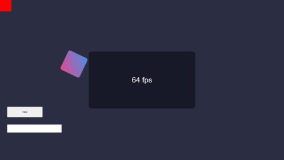
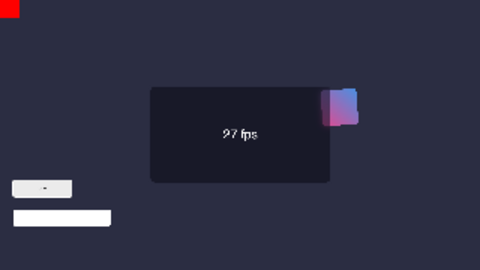
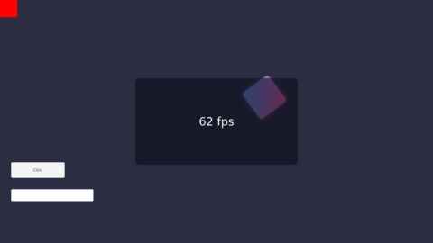

# Wry backend: feasibility

Phase 1 of the Wry add-on: can Wry's webview be drawn **inside** the game, into a texture the client's
`BrowserRenderer` samples like it samples CEF's, and how. Every number below comes from the probe in
[`prototype/`](../prototype), run locally and by the [Prototype workflow](../.github/workflows/prototype.yml)
on GitHub's runners.

## Short answer

| OS | Proven way into a texture | CPU copy per frame | Status |
|---|---|---|---|
| Windows | WebView2 **composition hosting** + **Windows.Graphics.Capture** of its visual → D3D11 texture → shared NT handle | no | works on the runner, pixels and alpha verified through the shared handle |
| macOS | WKWebView with WebKit's **remote layer tree** + **CARenderer** → IOSurface | no | works on macOS 15 and 26, correct pixels (upside down) and alpha; the page's own frame rate depends on how often the game's main thread lets WebKit run |
| Linux | WebKitGTK rendering into a **private Wayland compositor inside the process** → `wl_buffer` (shared memory without GPU, dmabuf with one) | no with a GPU (dmabuf), one small copy without | works with shared memory; the dmabuf half needs a machine with a GPU to confirm |

Input reaches the page without the page window ever taking focus from the game on all three.

The runners and this container have **no GPU** (Windows renders with WARP, Linux with llvmpipe, macOS on
Apple's paravirtual GPU). Frame rates below are therefore lower than on a real machine and only compare paths
against each other. Nothing here was measured inside the game yet: the probe stands in for it with its own GL
context (Linux) or its own D3D11/Metal device.

All tests: page size 1600×900, [test page](../prototype/page.html) animated every frame with a blurred
translucent panel, a red marker in the top left corner that the probe checks in the captured pixels, a
transparent background whose alpha the probe checks, and a text field and button for the input check.

## Windows (WebView2)

**What Wry exposes:** Wry's builder only creates an HWND-hosted `ICoreWebView2Controller`, a child window.
It exposes the controller, environment and `ICoreWebView2` (`WebViewExtWindows`), but not composition
hosting. The probe creates an `ICoreWebView2CompositionController` through `webview2-com`, the crate Wry is
built on.

**Path:** the composition controller renders into a `Windows.UI.Composition` `ContainerVisual` that is never
shown. `GraphicsCaptureItem.CreateFromVisual` captures that visual; every frame arrives as an
`ID3D11Texture2D` and is copied on the GPU (`CopyResource`) into a texture created with
`SHARED | SHARED_NTHANDLE`. The game opens the NT handle once with `GL_EXT_memory_object_win32`
(`GL_HANDLE_TYPE_D3D11_IMAGE_EXT`), exactly as MCEF already does for CEF's shared textures, or with
`WGL_NV_DX_interop2`, which Intel drivers support as well.

Runner: `windows-2025`, WebView2 runtime 153.0.4234.48, D3D11 adapter "Microsoft Basic Render Driver" (WARP).

| Path | Frames delivered | Page rAF | Cost per frame | Probe CPU | Result |
|---|---|---|---|---|---|
| Composition + Graphics.Capture | 37.2 fps | 64 fps | 0.08 ms (`CopyResource`, p95 0.13) | 12 % | marker ok and alpha 0 when read back through the NT handle on a **second** D3D11 device |
| same, visual attached to a hidden window | 38.0 fps | 64 fps | 0.07 ms | 10 % | same |
| Wry's HWND + `CreateForWindow` | – | – | – | – | fails: `Could not capture the given window (0x80070057)` for a tool window off-screen |
| `CapturePreview` (PNG) snapshot | 12.6 fps | 64 fps | 80.3 ms (p95 88.9, includes PNG decode) | 3 % | marker ok |

The 37 fps is the rate WARP's desktop compositor produced on the runner; Graphics.Capture delivers one frame
per composition, so on a GPU it follows the display's refresh rate. Capturing a visual shows no capture border
and asks for no permission.

**Input without focus:** mouse through `ICoreWebView2CompositionController::SendMouseInput` (wheel included),
keys and text through the DevTools protocol (`Input.dispatchKeyEvent`, `Input.insertText`), both called from the
probe while its window never had focus: `clicks=1;text=wry`.



## macOS (WKWebView)

**What Wry exposes:** Wry creates the WKWebView inside any `NSView` (`build_as_child`) and hands it out
(`WebViewExtMacOS::webview`). The probe uses Wry unchanged.

**Default mode does not work.** On macOS 15 WebKit shows the page through a `CALayerHost`: the pixels live in
another process and only the window server composites them. `CARenderer` drew nothing (0 frames). Only screen
capture (ScreenCaptureKit) could read them, which asks the player for screen-recording permission; not tried.

**Path: the remote layer tree.** WebKit's user default `WebKit2UseRemoteLayerTreeDrawingArea` (set in the
process's registration domain, nothing is written to disk) makes it deliver the page as a tree of layers inside
the process, whose tiles are IOSurfaces and whose `backdrop-filter` is a `CABackdropLayer`. macOS 26 does this
by default. `CARenderer` renders that tree into a Metal texture backed by an IOSurface; the game's OpenGL binds
the IOSurface with `CGLTexImageIOSurface2D`, the code MCEF already runs on macOS. The frame arrives upside down
(the `v1`/`v2` bounds of `BrowserTexture` flip it), and the target has to be cleared before each render or
transparent parts keep old frames.

The page's window must stay **on screen**: moved off-screen WebKit stops the page (0 fps), even with its
occlusion detection turned off. The probe's window is borderless, fully transparent (alpha 0) and ignores the
mouse, so the player never sees or hits it.

**The catch:** with the remote layer tree every page frame needs a few passes of the main run loop (commit,
display link, acknowledgement), and on macOS the main thread is the game's render thread. Serviced once per 60 Hz
frame, like SDL does, the page ran at ~20 fps. Letting WebKit use up to 4 ms of the frame to finish its work raised
it to ~50 fps on macOS 15. In the game this depends on the game's frame rate and needs measuring there.

Runners: `macos-15` (15.7.9) and `macos-26` (26.6.2), "Apple Paravirtual device"; macOS 26's VM is slower.

| Path | Frames delivered | Page rAF | Cost per frame | Result |
|---|---|---|---|---|
| Default (`CALayerHost`) + CARenderer | 0 | 60 fps | – | nothing to render |
| Remote layer tree + CARenderer, run loop drained once per frame | 21.5 / 14.5 fps | 18–25 / 11–22 fps | 3.7 / 4.0 ms (render and GPU wait) | page correct upside down, alpha kept (panel reads 153 = 0.6) |
| same, up to 4 ms run-loop time per frame | 31.8 / 23.1 fps | 47–54 / 28–43 fps | 2.4 / 3.8 ms + the waiting | same |
| Remote layer tree, window off-screen | 0 | 0 fps | – | WebKit stops the page |
| `takeSnapshot` (CPU copy), at most 60/s | 52.1 / 46.2 fps | 60 / 60 fps | 10.8 / 11.9 ms until the image arrives | marker ok |

(macOS 15 / macOS 26.) CARenderer only counts frames in which the layer tree changed. Before the run loop was
drained every frame, `takeSnapshot` managed only 7.7 fps at 135 ms.

**Input without focus:** `NSEvent`s sent straight to the WKWebView (`mouseDown:`/`mouseUp:`, `keyDown:` on
the first responder, `acceptsFirstMouse` on). The window never becomes the key window; its class only reports
itself as key so WebKit shows the caret. `clicks=1;text=wry` on both versions.



## Linux (WebKitGTK)

**What Wry exposes:** `WebViewBuilderExtUnix::build_gtk` puts the webview into any GTK container and
`WebViewExtUnix::webview()` hands out the `webkit2gtk::WebView`. WebKitGTK receives the page from its web
process as dmabufs, but keeps them private: GTK 3 only draws them into a GTK window. Wry's own child-window
mode needs an X11 parent and does not work with a Wayland game window.

**Path (recommended): a private Wayland compositor.** The add-on runs a minimal Wayland compositor
([smithay](https://github.com/Smithay/smithay)) on its own thread with a socket only this process knows. GTK
is started with the Wayland backend on that socket, so the page's window exists only there, whatever session
the game runs in (the probe runs it **without any X server or desktop**). Every frame GTK commits arrives as a
`wl_buffer`:

- with a GPU, Mesa hands out a **dmabuf** once the compositor advertises `zwp_linux_dmabuf_v1` for the render
  node, and the game imports it as an `EGLImage` (`EGL_EXT_image_dma_buf_import`), the code MCEF already runs
  for CEF on Linux: no copy on the CPU;
- without one, a shared-memory buffer that is copied once.

Input goes to the page as real Wayland seat events (`wl_pointer`, `wl_keyboard`), so focus in the game's
session is never touched.

Container: 4 vCPUs, no GPU, WebKitGTK 2.52.6, Mesa llvmpipe; CI numbers from `ubuntu-24.04` agree.



| Path | Frames delivered | Page rAF | Cost per frame | CPU probe / WebKit | Result |
|---|---|---|---|---|---|
| Private Wayland compositor (shared memory) | 62.1 fps | 62 fps | 0.52 ms copy on the compositor thread | 15 % / 229 % | marker ok, alpha kept, input ok |
| `GtkOffscreenWindow` readback | 57.3 fps | 51–59 fps | 5.05 ms on the GTK thread (p95 11.6) + 1.8 ms GL upload | 34 % / 210 % | marker ok, alpha kept, input ok (synthesized GDK events) |
| `webkit_web_view_get_snapshot`, 60/s | 58.8 fps | 55 fps (45 on CI) | 5.6 ms (p95 8.6) | 34 % / 208 % | marker ok, alpha kept |
| Wry's child window (X11) | – | 60 fps | – | – | shows, but is a separate X window over the game |

The WebKit processes' 210–230 % is software rendering on llvmpipe and says nothing about a real GPU.

**Not verified here: the dmabuf half.** Neither this container nor GitHub's runners have a GPU, so Mesa only
hands out shared memory. The probe already offers dmabufs when `/dev/dri/renderD*` exists and then imports
the first one on its own surfaceless EGL context and reads the marker back from the GPU. On a machine with a
GPU it can be checked with:

```sh
cd prototype && cargo run --release -- nested
# expected: "offering dmabufs for render node", "... N dmabuf", "dmabuf import: ... pixel at the marker [255, 0, 0, 255]"
```

The game can only import a dmabuf when it renders through EGL: always on a Wayland session, on X11 only with
`SDL_VIDEO_FORCE_EGL=1` (the client's MCEF acceleration has the same limit). On GLX the add-on falls back to
the shared-memory path.

## A window laid over the game

Every OS can show the webview as a child window over the game window (Wry's normal mode, and on Linux only
under X11). It was not pursued: the page is a separate window stacked above the game's GL surface, so it can't be
blended with the game, blurred behind, drawn under the HUD or combined with the in-game ClickGUI. It would also
fight the game for focus and misbehave in fullscreen.

## Bridge: JNI

A Rust `cdylib` with JNI (`jni` crate), not FFM:

- The native side is Rust either way and does the per-OS work; what crosses the boundary is small: create,
  navigate, resize, input, `update()` once per frame, and a texture handle. Callbacks (load state, console,
  cursor, title) are queued natively and drained by `update()` on the render thread, so neither bridge needs
  upcalls from foreign threads.
- JNI lets the Rust side throw Java exceptions with readable messages (WebView2 runtime missing, WebKitGTK
  missing) and convert strings and arrays in one place; with FFM that code moves into Kotlin as method handles
  and memory layouts that no compiler checks against the native side.
- It matches how the client already loads its other browser (MCEF/JCEF) and how the Ultralight add-on binds
  Ultralight.
- Java 25 restricts both equally; the 26.3 launcher profile passes `--enable-native-access=ALL-UNNAMED`, so
  neither prints a warning.

## Threading

The plan for phase 2; the probe ran each OS's pieces the same way, but not inside the game.

- **Windows:** WebView2, Windows.UI.Composition and Graphics.Capture all need an STA thread with a message
  loop and a dispatcher queue. The add-on gets its own thread for that instead of using the render thread, so a
  stalled WebView2 call never stalls a game frame and SDL's message pump stays untouched. Frames go into a
  small ring of shared textures; the render thread samples the newest finished one (a D3D11 event query marks
  it finished). Commands and input are posted to that thread.
- **macOS:** AppKit and WebKit must run on the main thread, which is the game's render thread (the launcher
  starts it with `-XstartOnFirstThread`). `update()` drains the main run loop's pending sources each frame
  (SDL's own pump takes only events) and renders the layer tree with CARenderer on the same thread. How much
  of the frame WebKit may use there decides the page's frame rate (see macOS).
- **Linux:** three threads: the compositor thread, a GTK thread running GTK's main loop (Wayland roundtrips
  from GTK to a compositor on the same thread would deadlock), and the render thread, which only imports
  buffers and releases them back once the next frame replaced them.

## Input without taking focus

| | Mouse | Keys | Text | Proven |
|---|---|---|---|---|
| Windows | `SendMouseInput` | DevTools `Input.dispatchKeyEvent` | DevTools `Input.insertText` | yes |
| macOS | `NSEvent` straight to the WKWebView (`mouseDown:`…) | `keyDown:`/`keyUp:` on the first responder | same | yes |
| Linux | `wl_pointer` events from the private compositor | `wl_keyboard` with an xkb keymap | keysyms, or `text-input-v3` for any Unicode | yes |

The page window never becomes the focused window of the session, so the game keeps its keyboard and mouse.

## The rest of the `Browser` contract

The APIs each backend would use; load state, console, cursor and scale were not part of the probe.

- **Load state:** WebView2 `NavigationStarting`/`NavigationCompleted` (with HTTP status), WebKitGTK
  `load-changed`/`load-failed`, WKWebView through Wry's page-load handler plus a navigation-failure check.
- **Console:** an initialization script forwards `console.*` over Wry's IPC (WebView2 `WebMessageReceived` on
  Windows) to the log.
- **Cursor:** WebView2 `CursorChanged` gives a system cursor id; WebKitGTK sets a named `GdkCursor` on its
  window that the GTK thread compares against the named cursors (the compositor itself only receives a cursor
  image); WebKit on macOS sets `NSCursor`. Each maps to Minecraft's cursor types. Not tried in the probe.
- **Incognito:** all three support it (`IsInPrivateModeEnabled`, `WebContext::new_ephemeral`, a
  non-persistent `WKWebsiteDataStore`), which Wry's `with_incognito` already wraps.
- **Scale (`GlobalBrowserSettings.quality`):** the viewport is sized in scaled pixels and the page zoomed by
  the quality, like the CEF and Ultralight backends do.

## Linux requirement: WebKitGTK

The native library links against `libwebkit2gtk-4.1.so.0`. The add-on would check for it (`dlopen`) when it
registers the backend: if it is missing, the backend's description on the selection screen says so and names
the package for the player's distribution, read from `/etc/os-release`:

| Distribution | Command |
|---|---|
| Arch, EndeavourOS, Manjaro | `sudo pacman -S webkit2gtk-4.1` |
| Debian, Ubuntu, Mint | `sudo apt install libwebkit2gtk-4.1-0` |
| Fedora | `sudo dnf install webkit2gtk4.1` |
| openSUSE | `sudo zypper install libwebkit2gtk-4_1-0` |

Picking it anyway would end in the client's error screen with the same text instead of a crash. On Windows the
same check covers the WebView2 runtime (present on Windows 11 and on updated Windows 10) with the download link.

## Distribution

Wry, webview2-com, objc2 and smithay are MIT or Apache-2.0, so the natives can ship inside the add-on jar and
be unpacked on first start, with their licenses. CI would build them per platform:

| Target | Runner |
|---|---|
| windows-x64 | `windows-2025` |
| macos-arm64, macos-x64 | `macos-15` (x64 cross-compiled, or one universal library) |
| linux-x64, linux-arm64 | `ubuntu-22.04`, `ubuntu-22.04-arm` (older glibc so more distributions can load it) |

The Linux library links WebKitGTK and GTK dynamically and bundles nothing of them.

## Open points

- **macOS page frame rate** under the remote layer tree is tied to the game's frames and was only measured on
  slow VMs. `takeSnapshot` is the fallback: steadier, one CPU copy per frame.
- **Linux dmabuf** is unverified until run on a GPU (command above).
- **Windows GPU import into the game's OpenGL** is MCEF's existing code; it has not been run against this
  texture. Without `GL_EXT_memory_object_win32` or `WGL_NV_DX_interop2` the fallback maps the texture and
  uploads it (one CPU copy).
- **Vulkan:** 26.3 can also render with Vulkan; like MCEF's acceleration, the zero-copy paths above target the
  OpenGL backend. On Vulkan the same handles import through `VK_KHR_external_memory_win32`,
  `VK_EXT_external_memory_dma_buf` and `VK_EXT_metal_objects`, not tried here.
- On Windows Wry's builder is bypassed for the webview itself; Wry features the add-on needs there
  (initialization scripts, IPC, custom protocol) are a few calls on the same `ICoreWebView2`.
- GTK can only be started once per process. If another mod already started it for its own window on the game's
  display, the private compositor can't be used and the add-on has to say so.
- The whole design is untested inside the game: next to the game's own SDL window, GPU context and frame
  pacing.

## What I need from you

Which approach to build. My recommendation:

1. **Windows:** composition hosting + Windows.Graphics.Capture, shared texture into the game's OpenGL
   (CPU copy only where neither import extension exists).
2. **Linux:** the private Wayland compositor; dmabuf into the game when it renders through EGL, shared memory
   otherwise.
3. **macOS:** either
   - **a)** remote layer tree + CARenderer, no CPU copy, the page's frame rate following the game's, or
   - **b)** `takeSnapshot`, one CPU copy per frame, steadier;
   
   or a) with b) as the fallback.
4. **JNI** for the bridge.

Also useful: running `cargo run --release -- nested` in `prototype/` on a Linux machine with a GPU, to confirm
the dmabuf half before I build on it. The `prototype/` directory and its workflow go away in phase 2; they stay
in this branch's history.
